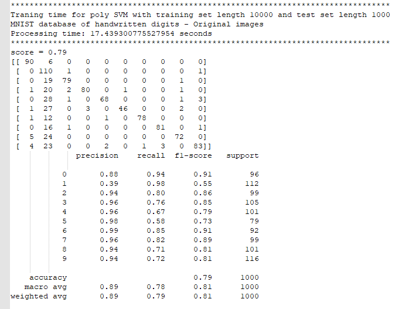
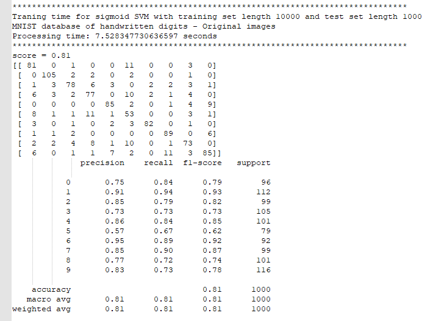
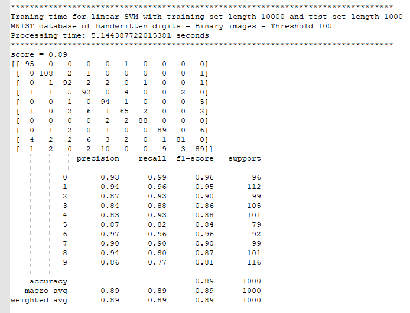

# Handwritten-digits-recognition-by-SVM-classifier
**The objective of this project is to use the Support Vector Machine (SVM)
classifier to train a simple system for the recognition of handwritten digits
(0, 1, …, 9).**

This project uses the MNIST database of handwritten digits for testing and
training the system which is attached here as "mnist_handwritten.csv." It
contains 60k images that are sorted as one vector, each with its labels.

To begin with, we select a subset of the database consisting of the first 1000
images (image indexes from 0-1000) of handwritten digits for training the system
and use another 100 images for testing the system (image indexes from
2000-2100). Then we train the SVM classifier with the training set and classify
the handwritten digits of the testing images using the trained SVM model.
Finally, we can compute the accuracy.

First, I read the MNIST dataset file and put it in a Pandas DataFrame. I
converted the dataset to a CSV file to speed up this process and then put the
CSV file to a DataFrame. Then, I separated the train set and test set by
considering the image label column and image data columns. Finally, using
function svm_classifing, I generated the predicted labels for the test set data
and calculated the confusion matrix and the accuracy by functions
confusion_matrix and classification_report separately. As you can see in the
figure below, the accuracy is 85%.

****

We repeat the experiment for training the SVM classifier with a large database.
The first 10000 images for training (image indexes from 0-10000) and test with
100 images (images indexes from 20000-20100).

As you can see in the figure below, we can achieve a more accurate model by
increasing the size of the training set. Having 10000 images in the training
set, the accuracy is 90%.

****

By repeating the experiment for training the SVM classifier with the same set of
training images (image indexes from 0-10000) and test with another 1000 images
(image indexes from 20000-21000), considering a decent size for the test set, we
can find our model's maximum accuracy. Here, increasing the test set's size does
not significantly affect calculating the accuracy because it is the utmost
accuracy.

****

We depicted the confusion matrices in the figures above.

To visually compare the classifier's accuracy, six images and their
corresponding predicted numbers are randomly selected. As the figure below
shows, all the predictions are correct.

|                 |  |
|----------------------------------------------------------------|-------------------------------------------------|
|                 |  |
|                 |  |
| Predicted number and the actual number for the original images |                                                 |

We can now repeat the experiment for training the SVM classifier with different
kernel functions (e. g. rbf, polynomial, etc.).

Applying different kernels, we can find that the Gaussian kernel (rbf) has the
best accuracy (95%). One reason is that in the MNIST dataset, the non-black
pixels have a Gaussian distribution.

****

****

****

Then we create binary images of the handwritten digits by simple thresholding
and repeat the experiment above.

Since converting gray images to binary adds some noise to the image or
eliminates some parts of the image, it cannot increase the accuracy but also
decreases the accuracy in some cases. The following figures show the
classifier's evaluation of binary images with a threshold of {200, 150, 100, 50,
1}. The best results are for threshold 200.

****

|                |  |
|---------------------------------------------------------------|-------------------------------------------------|
|                |  |
|                |  |
| The predicted number and the actual number when threshold=200 |                                                 |

****

|                |  |
|---------------------------------------------------------------|-------------------------------------------------|
|                |  |
|                |  |
| The predicted number and the actual number when threshold=150 |                                                 |

****

|                |  |
|---------------------------------------------------------------|-------------------------------------------------|
|                |  |
|                |  |
| The predicted number and the actual number when threshold=100 |                                                 |

****

|               |  |
|--------------------------------------------------------------|-------------------------------------------------|
|               |  |
|               |  |
| The predicted number and the actual number when threshold=50 |                                                 |

****

|              |  |
|-------------------------------------------------------------|-------------------------------------------------|
|              |  |
|              |  |
| The predicted number and the actual number when threshold=1 |                                                 |

The table below is a comparison table for the accuracy of all parts above.

| Dataset size                     | Method | Accuracy |
|----------------------------------|--------|----------|
| Training set 1000 Test set 100   | Linear | 0.85     |
| Training set 10000 Test set 100  | Linear | 0.90     |
| Training set 10000 Test set 1000 | Linear | 0.91     |

*Comparing the effect of training set's size on the accuracy*

| Dataset size                     | Method  | Accuracy |
|----------------------------------|---------|----------|
| Training set 10000 Test set 1000 | Linear  | 0.91     |
| Training set 10000 Test set 1000 | Poly    | 0.79     |
| Training set 10000 Test set 1000 | rbf     | 0.95     |
| Training set 10000 Test set 1000 | sigmoid | 0.81     |

*Comparing the effect of the kernel on the accuracy*

| Dataset size                                                             | Method | Image type                                      | Accuracy |
|--------------------------------------------------------------------------|--------|-------------------------------------------------|----------|
| Training set 10000 Test set 1000                                         | Linear | Original                                        | 0.91     |
| Training set 10000 Test set 1000                                         | Linear | Binary – Thr 200                                | 0.87     |
| Training set 10000 Test set 1000                                         | Linear | Binary – Thr 150                                | 0.88     |
| Training set 10000 Test set 1000                                         | Linear | Binary – Thr 100                                | 0.89     |
| Training set 10000 Test set 1000                                         | Linear | Binary – Thr 50                                 | 0.88     |
| Training set 10000 Test set 1000                                         | Linear | Binary – Thr 1                                  | 0.90     |
| *Comparing the effect of binary threshold on the accuracy*               |        |                                                 |          |
|                           |        |  |          |
| Original                                                                 |        | Threshold=200                                   |          |
|                           |        |  |          |
| Threshold=150                                                            |        | Threshold=100                                   |          |
|                           |        |  |          |
| Threshold=50                                                             |        | Threshold=1                                     |          |
| Comparing the effect of the binary images on the accuracy of the trainer |        |                                                 |          |

**References:**

<https://towardsdatascience.com/support-vector-machine-mnist-digit-classification-with-python-including-my-hand-written-digits-83d6eca7004a>

<https://pjreddie.com/projects/mnist-in-csv/>

<https://stackabuse.com/implementing-svm-and-kernel-svm-with-pythons-scikit-learn/>

<https://towardsdatascience.com/support-vector-machine-python-example-d67d9b63f1c8>

